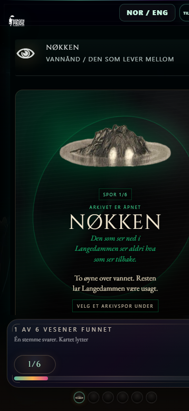

DIKULT216 – Digitale spill

Kandidatnummer: 134

Antall ord: 1586

<!-- PAGEBREAK -->

**Pride Park 2026: Å designe skeiv tilhørighet utenfor den klassiske spillmodellen**

Bachelorprogram i digital kultur

Institutt for lingvistiske, litterære og estetiske studium

Det humanistiske fakultet

Universitetet i Bergen

<!-- PAGEBREAK -->

## Innholdsfortegnelse

<!-- TOC -->

<!-- PAGEBREAK -->

# Pride Park 2026: Å designe skeiv tilhørighet utenfor den klassiske spillmodellen

*Figure 1. Pride Park 2026 startskjerm — Den Mytiske Skogen. Introduksjonsskjermen etablerer spillets ludiske løfte: regnet beveger seg, lysene svarer på berøring, og NOR/ENG-bryteren og tilgjengelighetsmenyen er synlig øverst som en del av spillets etiske arkitektur.*

## 1. INNLEDNING

Telefonen vibrerer i hånden. En QR-kode i Nygårdsparken er scannet, og Nøkken trer frem på skjermen. Spilleren leser om vannet, om skjulte møter og om skeive liv som lenge måtte bevege seg gjennom Bergen uten å bli for synlige. Ingenting er vunnet i klassisk forstand, men noe har våknet.

Pride Park 2026 er et nettleserbasert HTML5-spill laget for Bergen Pride 2026, der Nygårdsparken, Pride House, MiniPride, CDN Læringslab og Regnbuenatt samles i ett kartgrensesnitt (Bergen Pride 2026a; TicketCo 2026). Spilleren oppdager seks vesener fra norsk folketro: Nøkken, Huldra, Fossegrimen, Draugen, Mare og Bergtrollet. Å finne alle seks låser opp en premiekode. En kort videodokumentasjon av spillflyten er vedlagt som supplement: [LENKE]. Essayet argumenterer for at spillet forskyver Jesper Juuls vekt på valoriserte utfall og i stedet simulerer skeiv tilhørighet som en egen ludisk logikk. Nettopp fordi Pride Park 2026 passer dårlig inn i Juuls klassiske modell, blir det analytisk interessant.

*Figure 2. Pride Park 2026 kartinterface. Det digitale kartet gjør Nygårdsparken til et spillbart rom med hotspots, vesenmarkører og festivalnoder.*

## 2. TEORETISK RAMMEVERK

Juuls modell fungerer her som et analytisk gnisningspunkt. I *Half-Real* argumenterer han for at spill alltid befinner seg mellom formelle regler og fiktive verdener, og at denne spenningen er selve spillets kjerne (Juul 2005, 1–6, 36–43). Pride Park 2026 bruker denne spenningen, men vender den bort fra dominans og mot gjenkjennelse.

Frans Mäyräs skille mellom spillets kjerne og spillets skall gjør denne forskyvningen tydelig (Mäyrä 2008, 17–18). Kjernen er enkel: spilleren skal oppdage seks vesener. Skallet, der norsk folklore møter Pride-estetikk, haptikk, lyd, sted og skeiv kulturhistorie, bærer argumentet. Ian Bogost kaller dette *procedural rhetoric*: spill argumenterer gjennom regler og prosesser snarere enn gjennom tekst alene (Bogost 2007, ix, 46). I Pride Park 2026 våkner verden ikke når spilleren beseirer noen, men når spilleren lærer å se.

Ruberg og Shaw gir det queer-teoretiske rammeverket for denne forskyvningen ved å lese spill som rom for avvik, nærvær og kulturell betydning utenfor ren mestring (Ruberg 2019; Shaw 2014). Hodne og Skeivt Arkiv forankrer samtidig prosjektet i norsk folketro og lokal skeiv historie, der liminale vesener og marginale møteplasser allerede deler et språk om grenseerfaring (Hodne 1999; Skeivt Arkiv 2020). Frasca, Jørgensen, Jørgensen og Karlsen, samt Stenros og Montola gjør det mulig å lese spillet som simulering, grensesnitt og materielt regelverk snarere enn bare fortelling (Frasca 2003, 221–235; Jørgensen 2013; Jørgensen og Karlsen 2019; Stenros og Montola 2024, 8, 11–12).

## 3. KONSEPTUELT RAMMEVERK

CSS-variabelen `--forest-awake` er spillets poetiske maskin. Den stiger fra null til én etter hvert som vesener oppdages og modulerer den visuelle og atmosfæriske tilstanden i grensesnittet: skogen blir mørkere, slørene tettere, nordlyset sterkere og overgangene tydeligere. Manovich beskriver nye medier som bygget av kode tilgjengelig for programmerbar variasjon (Manovich 2001, 49, 55–56), og her oversettes en tallverdi til skogens emosjonelle tilstand. Variabelen styrer ikke hele lydsystemet direkte, men gjør progresjon til stemning.

De seks vesenene er noder i et skeivt arkiv, ikke boss encounters. Huldra forhandler mellom synlighet og skjuling. Nøkken lever i overflaten mellom begjær og fare. Fossegrimen kobler kunst, lyd og kropp. Draugen bærer minner som ikke lar seg begrave. Bergtrollet nekter å flyttes. Mare er nattens trykk mot kroppen. I stedet for å bekjempe monsteret, lærer spilleren å lese det.

Arkivet artikuleres også gjennom en konkret lydlogikk. I Eira-playlisten kobles passasjer til bestemte spor: «Running in The Forest» til hovedkartet, «Guten og Huldra» til Huldra, Sinikka Langelands «Nøkken» til Nøkken, Ivar Medaas' «Knepphalling» til Fossegrimen, «The Evening Breath» til Mare, Griegs «In the Hall of the Mountain King» til Bergtrollet og «Der Kjem Systemet» til CDN. Spillkredittene presiserer at det meste av musikken er produsert av Mount Media, mens Witch Princess' «Snow Raven» er unntaket i Marinehagen. Mount Media fungerer dermed ikke som et eksternt soundtrack, men som en auditiv produksjonslogikk der norsk folkemusikk, kulturhistoriske referanser og klubbestetikk remikses inn i bestemte steder, vesener og grensesnitt.

*Figure 3. Nøkken som oppdaget vesen. Vesenet fungerer ikke som fiende, men som en skeiv folklore-node spilleren lærer å se.*

## 4. GRENSESNITTDESIGN

Kartet er primærgrensesnittet, med glødende hotspots, vesenmarkører og en mørk skogestetikk mellom natur, teknologi og Pride. Men kartet er også mer enn et navigasjonssystem: det leder ikke bare til vesenene, men også til Pride House, MiniPride, hovedscene, parade, Marinehagen og CDN Læringslab. Spillet fungerer dermed både som spill og som festivalguide.

Hver vesenpassasje er bygget i tre faner: folklore, queer history og park info. Det betyr at samme node kombinerer mytologisk fortelling, lokal skeiv historie og praktisk orientering i parkrommet. Denne tredelingen er viktig fordi den gjør vesnene til mer enn narrativ pynt. De fungerer som knutepunkter der folklore, arkiv og infrastruktur holdes sammen i ett og samme grensesnitt.

Tilgjengelighetsmenyen gjør dette enda tydeligere. Den tilbyr NOR/ENG-veksling, lydspor og volumkontroll, tekststørrelse, lesbar skrift, høy kontrast, roligere grafikk, mindre bevegelse og haptikk. I tillegg har kartet en egen terrengmodus. Donald Norman viser at design gjør noen handlinger mulige og andre usynlige (Norman 2013, 10–11), og disse valgene er derfor ikke tekniske tillegg, men del av spillets etiske arkitektur.

### 4.1 Brukernavigasjon

Navigasjonen er ikke lineær. Rekkefølgen er valgfri, og spilleren kan hoppe mellom noder fritt. Kartet har også snarveier til scene, Pride House, parade og nattspor uten at kartflyten brytes. Mäyrä skiller mellom semiosis og ludosis og viser at mening produseres gjennom handlinger, ikke bare tegn som avkodes (Mäyrä 2008, 18–19). Spilleren leser ikke Pride Park. Spilleren spiller den frem.

### 4.2 Oppdagelse, progresjon og belønning

Premien er bevisst tvetydig. Spillet ligner en collectathon, men slutter ikke i en high score. Det slutter i en sosial handling: å løse opp en kode, gå videre i festivalrommet og møte noen. Premiekoden peker dermed ut av spillets kontekst og inn i festivalrommet. Digital progresjon blir en invitasjon til fysisk deltagelse.

*Figure 4. Progresjonssystemet. Seks oppdagelser låser opp en belønning, men progresjonen fungerer først og fremst som en dramaturgi for samling og tilhørighet.*

## 5. TEKNISK IMPLEMENTASJON

Spillet er ett selvstendig HTML5-dokument med JavaScript, CSS, localStorage og haptisk feedback. HTML5 betyr direkte tilgang fra nettleseren uten installasjon, noe som er avgjørende i et festivalmiljø med ulike enheter og begrenset tid. Stenros og Montola argumenterer for at kode og designerrefleksjoner begge er deler av spillets regelstruktur (Stenros og Montola 2024, 9–11). Koden er derfor ikke infrastruktur utenfor analysen, men en del av argumentet.

### 5.1 Haptikk, QR og responsivt HTML5-design

Oppdagelseslogikken er koblet både til kartets hotspots og til egne QR-lenker for hvert vesen. Repoet inneholder et eget utskriftsark for parkens QR-koder, der hver skapning er knyttet til en URL-parameter som åpner riktig passasje direkte. Forbindelsen mellom fysisk punkt og digital node er derfor implementert, ikke bare tenkt.

Hvert vesen utløser også en eskalerende ritualsekvens: fra ett kort pulsmønster til syv pulser over mer enn ett sekund. Haptikken gjør oppdagelse til noe kroppen registrerer, ikke bare noe øyet ser. Hvis enheten ikke støtter Vibration API, erstattes dette av visuell puls og toast-melding. Responsen er altså ikke fraværende, bare modalitetsskiftende. Det underbygger Jørgensens poeng om at *gameworld interfaces* alltid er kroppslige og sanselige (Jørgensen 2013).

### 5.2 CDN Learning Lab og Bergen 2063

Inne i kartet ligger en node for Centre for Digital Narrative, som driver humanioraforskning på elektronisk litteratur og algoritmisk narrativitet ved UiB (Center for Digital Narrative 2026). Noden inneholder Bergen 2063, et nestet arkadespill som fungerer best i liggende modus. Bergen 2063 modellerer et fremtidig Bergen der spilleren navigerer gjennom data og overvåkning, og i Frascas forstand er dette en simulering av CDNs temaer snarere enn bare en representasjon (Frasca 2003, 221–235).

*Figure 5. CDN som forskningsnode. CDN-passasjen gjør digitale narrativer, data og forskningsformidling til et spillbart punkt i Pride Park.*

*Figure 6. Bergen 2063 i CDN Learning Lab. Det nestede arkadespillet modellerer data, overvåkning og digital infrastruktur som et handlingsrom spilleren må navigere.*

### 5.3 Glitch, debugging og etisk design

Mobil-CSS som kollapset, Safari som håndterte lyd annerledes, tekst som ble kuttet på små skjermer: hvert teknisk problem stilte det samme spørsmålet spillet forsøker å stille kulturelt. Hvem får tilgang, og hvem blir stående utenfor? Rosa Menkman beskriver glitch som en måte å synliggjøre det som vanligvis skjules i digitale systemer (Menkman 2010, 9–10). Å debugge ble derfor en etisk praksis. Tilhørighet må bygges inn i navigasjon, lydavspilling, responsivitet og returknapper, ikke bare skrives inn i teksten.

## 6. ROMLIG OG PERFORMATIV UTVIDELSE

Spillet slutter ikke ved skjermen. Repoet inneholder et eget utskriftsark for vesenenes QR-koder med instruksjonen om å henge en kode ved hvert fysisk punkt. Det digitale kartet og den fysiske parken er derfor to deler av samme system. Parken blir spillbrettet, og de stedbundne punktene blir det Stenros og Montola kaller materielle regler: betingelser som former spillopplevelsen uten å stå som eksplisitte regler i spillteksten (Stenros og Montola 2024, 8).

### 6.1 MiniPride, Pride Park og Regnbuenatt

MiniPride er ikke en sidesone, men en annen form for skeiv omsorg. Bergen Pride beskriver det som et røyk- og rusfritt familierom der formålet er å synliggjøre familiemangfold og la barn se at de kan være den de er (Bergen Pride 2026b). Hvis Regnbuenatt handler om kropp, bass og natt, handler MiniPride om trygghet, lek og fremtid.

*Figure 7. MiniPride og Glimmerstien. MiniPride fungerer som en egen omsorgslogikk i spillet, der lek, trygghet og skeiv fremtid står i sentrum.*

Regnbuenatt er prosjektets rituelle forlengelse, der de samme vesenene vekkes i Marinehagen gjennom lys, tåke, lyd, performer-cast og BERGTATT-visuals (TicketCo 2026). Overgangen fra Den Mytiske Skogen til Den Forbudte Skogen er samtidig en regelstyrt forskyvning i rommets bruk: dagkartets familieorienterte park blir til en nattlig 18+-arena med aldersverifisering, ny lyd og et annet performativt register. Danserne og visualsystemet fungerer som levende *gameworld interfaces* som oversetter det mytologiske systemet til kroppslig nærvær.

*Figure 8. Regnbuenatt som performativ forlengelse. Vesenene flyttes fra kart og kode til lys, lyd, dans og fysisk klubbrom.*

## 7. METODE OG POSISJONALITET

Min posisjon som designer er ikke utenfor denne analysen. Jeg jobber som digital strateg for Bergen Pride, er intern ved Centre for Digital Narrative på SurvivingSOGICE-prosjektet, og står også bak Mount Media, prosjektets musikk- og produksjonsplattform. Spillet er derfor laget innenfra de miljøene det handler om. Stephanie Jennings argumenterer for at forsker-spillere er integrerte deler av spillene de studerer, og at denne sammenfiltringen er en produktiv kunnskapsform snarere enn en feilkilde (Jennings 2025). Denne innenfra-posisjonen gjør at vesenene ikke blir dekorasjon, men en måte å oversette skeiv erfaring til sted, kropp, lyd og spillmekanikk.

## 8. KONKLUSJON

Pride Park 2026 viser at et spill kan bruke oppdagelse, sted, kropp, folklore og festivalinfrastruktur til å designe skeiv tilhørighet uten å underordne seg mestringslogikkens krav om seier og tap. Juuls modell er nyttig fordi den synliggjør hva spillet forskyver. Vesenene blir ikke beseiret, men funnet. Monsteret viser ikke trussel, men hvor fellesskapet allerede finnes.

Samtidig viser prosjektet at digital tilhørighet ikke kan skilles fra teknisk ansvar. Et spill som hevder å inkludere, må også fungere på ulike telefoner, språk, kroppslige behov og måter å orientere seg på. I Pride Park 2026 er det å finne hverandre derfor ikke bare en metafor, men en serie konkrete grensesnittvalg, regler og koblinger mellom kode, park og kropp.

---

## LITTERATURLISTE

Bergen Pride. 2026a. "Bergen Pride." Lest 14. mai 2026. https://www.bergenpride.no/.

Bergen Pride. 2026b. "Mini Pride." Lest 14. mai 2026. https://www.bergenpride.no/mini-pride/.

Bogost, Ian. 2007. *Persuasive Games: The Expressive Power of Videogames*. Cambridge, MA: MIT Press.

Center for Digital Narrative. 2026. "Center for Digital Narrative." Universitetet i Bergen. Lest 14. mai 2026. https://www4.uib.no/en/research/research-centres/center-for-digital-narrative.

Frasca, Gonzalo. 2003. "Simulation versus Narrative: Introduction to Ludology." I *The Video Game Theory Reader*, redigert av Mark J. P. Wolf og Bernard Perron, 221–235. New York: Routledge.

Hodne, Ørnulf. 1999. *Norsk folketro*. Oslo: Cappelen.

Jennings, Stephanie C. 2025. "Autoethnographic Denial: The Disavowal of Game Studies' Most Fundamental Methodology." I *Historiographies of Game Studies*. Brooklyn: Punctum Books.

Jørgensen, Kristine. 2013. *Gameworld Interfaces*. Cambridge, MA: MIT Press.

Jørgensen, Kristine, og Faltin Karlsen, red. 2019. *Transgression in Games and Play*. Cambridge, MA: MIT Press.

Juul, Jesper. 2003. "The Game, the Player, the World: Looking for a Heart of Gameness." I *Level Up: Digital Games Research Conference Proceedings*, redigert av Marinka Copier og Joost Raessens, 30–45. Utrecht: Utrecht University.

Juul, Jesper. 2005. *Half-Real: Video Games between Real Rules and Fictional Worlds*. Cambridge, MA: MIT Press.

Manovich, Lev. 2001. *The Language of New Media*. Cambridge, MA: MIT Press.

Menkman, Rosa. 2010. "Glitch Studies Manifesto." I *Video Vortex Reader II: Moving Images Beyond YouTube*, redigert av Geert Lovink og Rachel Somers Miles, 336–347. Amsterdam: Institute of Network Cultures.

Mäyrä, Frans. 2008. *An Introduction to Game Studies: Games in Culture*. London: SAGE.

Norman, Donald A. 2013. *The Design of Everyday Things*. Rev. utg. New York: Basic Books.

Ruberg, Bonnie. 2019. *Video Games Have Always Been Queer*. New York: New York University Press.

Shaw, Adrienne. 2014. *Gaming at the Edge: Sexuality and Gender at the Margins of Gamer Culture*. Minneapolis: University of Minnesota Press.

Skeivt Arkiv. 2020. "Skeive demonstrasjoner og festivaler i Bergen." Lest 14. mai 2026. https://skeivtarkiv.no/skeivopedia/skeive-demonstrasjoner-og-festivaler-i-bergen.

Stenros, Jaakko og Markus Montola. 2024. *The Rule Book: The Building Blocks of Games*. Cambridge, MA: MIT Press.

TicketCo. 2026. "Regnbuenatt 2026." Lest 14. mai 2026. https://bergenpride.ticketco.events/no/nb/e/regnbuenatt_2026.
